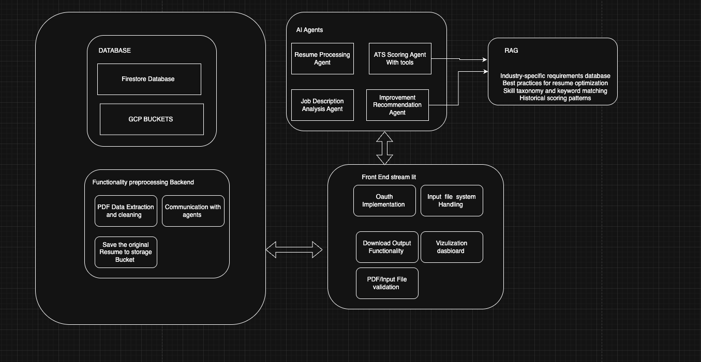
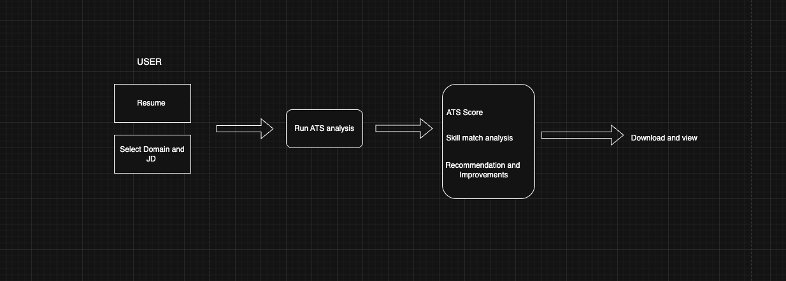

# ATS Resume Scoring

This project provides an AI-powered platform for scoring resumes against job descriptions using advanced language models and retrieval-augmented generation (RAG). It helps job seekers optimize their resumes for Applicant Tracking Systems (ATS) and assists recruiters in evaluating candidate fit.

## Features

- **Resume Parsing:** Extracts and processes resume content from PDF files.
- **Job Description Analysis:** Analyzes job descriptions to identify key requirements.
- **ATS Scoring:** Scores resumes based on their relevance to job descriptions using AI agents.
- **Recommendations:** Provides actionable suggestions to improve resume ATS compatibility.
- **RAG Integration:** Uses a local Chroma database for document retrieval and context enrichment.
- **Streamlit UI:** Interactive web interface for uploading resumes and viewing results.

## Directory Structure

- `home.py` : Main Streamlit app entry point.
- `backend/agents/` : AI agents for resume processing, job description analysis, scoring, and recommendations.
- `backend/prompts.py` : Prompt templates for agents.
- `backend/models/` : Language model client wrappers.
- `backend/utils/` : Utility scripts for PDF reading, database access, validation, etc.
- `RAG/` : RAG pipeline scripts, preprocessing, embeddings, and data.
- `assets/` : Images and UI assets.
- `sampledata/` : Example resumes for testing.
- `chroma_db/` : Chroma vector database files.
- `.streamlit/` : Streamlit configuration.
- `requirements.txt` : Python dependencies.

## Getting Started

1. **Clone the repository:**
   ```sh
   git clone <your-repo-url>
   cd ATS\ Resume\ Scoring
   ```

2. **Install dependencies:**
   ```sh
   pip install -r requirements.txt
   ```

3. **Set up environment variables:**
   - Copy `.env.example` to `.env` and update with your API keys and settings.

4. **Run the Streamlit app:**
   ```sh
   streamlit run home.py
   ```

## Usage

- Upload a resume (PDF) and select a job description.
- View ATS score and recommendations to improve your resume.
- Explore RAG-powered document search and context enrichment.


## Components



Note : Data base integration is yet to be done


## FLOW 



## Customization

- Update prompt templates in `backend/prompts.py` for different scoring strategies.
- Add new agents in `backend/agents/` for custom analysis.
- Modify RAG pipeline in `RAG/` for advanced retrieval.

## License

MIT License

---

For questions or contributions, please open an issue or submit a pull request.
